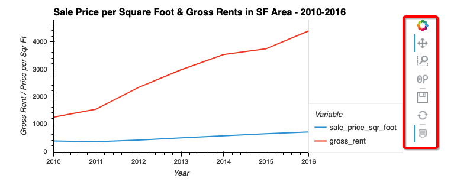

# UWFintech Challenge 6 - San Francisco Housing Market Analysis
## Project Description
In this challenge I have created a Jupyter Notebook that contains analysis of the San Fransisco housing market between 2010 and 2016. I am primarily looking at average gross rents and sale price per square foot over this period and drilling down into these numbers by neighborhood. Using data visualization and aggregation I am analyzing the trends in these areas and making recomendations regarding whether a buy-and-rent strategy would be a good strategy as of right after 2016.

## Technologies
**Python 3.7**  
**Jupyter Notebooks**  
**Pandas**  
**hvplot**  
**pathlib**  

## Usage

While using the interactive plots within the notebook, you can use the widgets found on the right side of the plot to do the following:
+ Pan around the plot (drag the view)
+ Select a zoom area
+ Use the scroll wheel to zoom in and out
+ Save the current view of the chart as a .png
+ Refresh the plot to the original view
+ Toggle the hover feature on and off  
Please note - multiple of these features can be active at the same time.

## Contributors
Jacob Vissering
