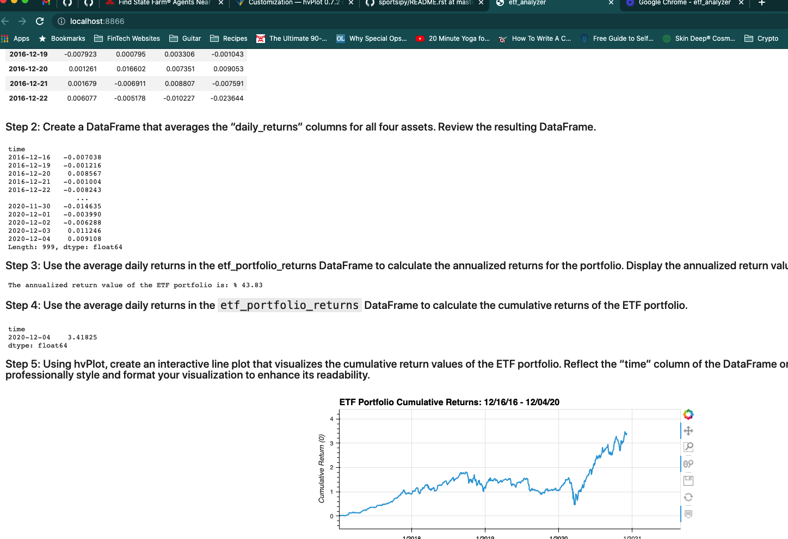

# UW Challenge - Module 7

## Project Description
In this project I'm accessing a database that contains four tables that hold the information for four stocks within an ETF. Using SQLalchemy I'm grabbing the information I need to analyze single assets within the ETF, cleaning the data for easy viewing, manipulating the data to calculate various metrics and then analyzing it using hvplot. Upon completion of the analysis I use the voila library to create a web application for the analysis. 

## Technologies
**Python 3.7**  
**pandas** 
**numpy**  
**hvplot**  
**sqlalchemy**  
**Jupyer Labs**  
**Voila**  

## Usage

The Jupyer Notebook was created as a live web application on my machine. Video of web application can be found [HERE](https://loom.com/share/6dd8a6d354aa45058dbc4137193a8e42).

Screenshot of live web application:

## Contributors
Jacob Vissering

